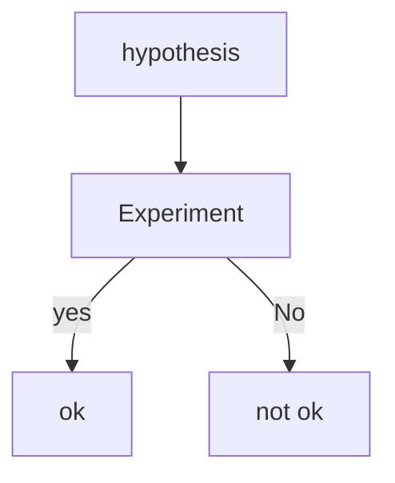
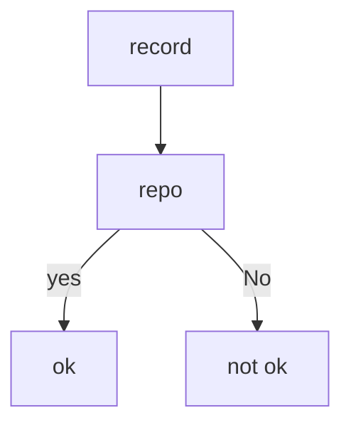

# scientific analysis and presentation
----
## 1차 숙제
서울시 기온평균

최고기온 최저기온

미래 예측
```python
  def():
    return
``` 

```mermaid
  flowchart TD;
    A[hypothesis] -->B[Experiment];
    B -- yes --> C[ok];
    B -- No --> D[not ok];
```

```mermaid
  flowchart TD;
    A[record] -->B[repo];
    B -- yes --> C[ok];
    B -- No --> D[not ok];
```
